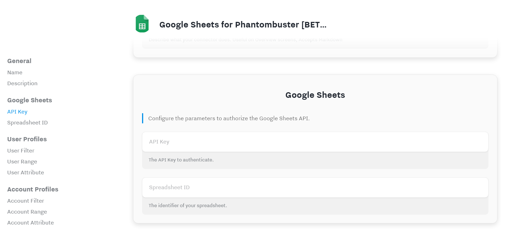

# Hull Google Sheets for Phantombuster [BETA]

The Hull Connector for Google Sheets allows you to automate your Phantombuster crawling by automatically adding new users or accounts to your spreadseets.

> This connector is under active development, features are subject to change and the documentation might not be complete yet.

## Getting Started

1. From your Hull Connectors page click on **Add a Connector**.
2. Search for "Google Sheets for Phantombuster" and click on **Install**
3. Authorize Hull to connect with the Google Sheets API by entering the credentials for a service account:
   

## Sending data to Google Sheets

The connector allows you to send user and/or account profiles in a single column range in Google Sheets.

### User Profile Data

The description _is not available yet_.

### Account Profile Data

The description _is not available yet_.

## FAQ

### When is a profile being added to the spreadsheet

The connector receives updates from the Hull platform if anything on a given user or account profile changes and then almost immediately calls the Google Sheets API if the profile has a value for the given attribute and if that value is not already present in the given range.

### Why do I need a service account

The Google Spreadsheet API doesn't allow unauthenticated users to make changes to a spreadsheet, so you have to authorize the API calls. A service account is for robotic automations and therefore used to authenticate requests. All you need to do is create a service account in the Google Cloud Console and invite that service account as editor to all your sheets. This way you stay in full control over your data, you can assign quotas and track your API usage.
